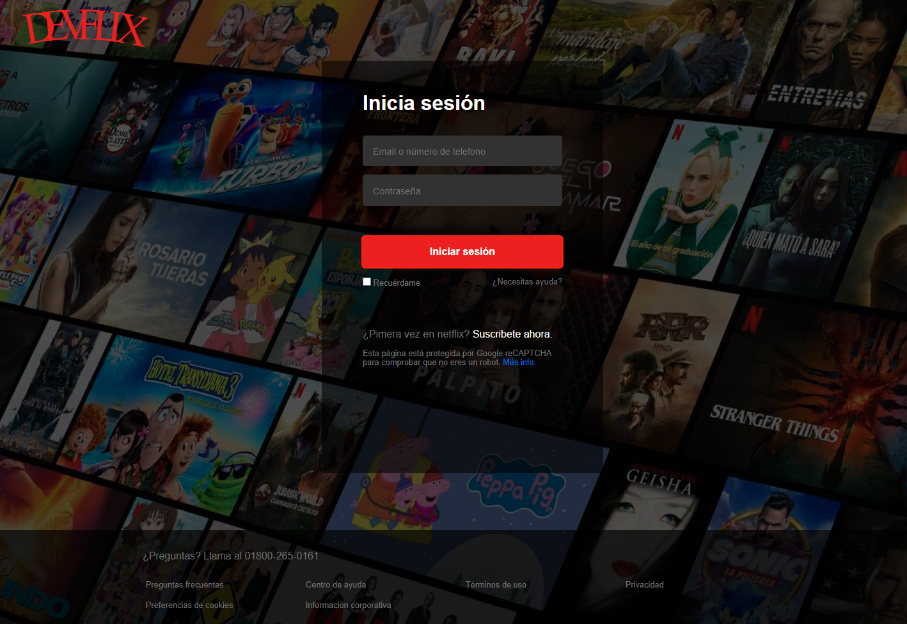
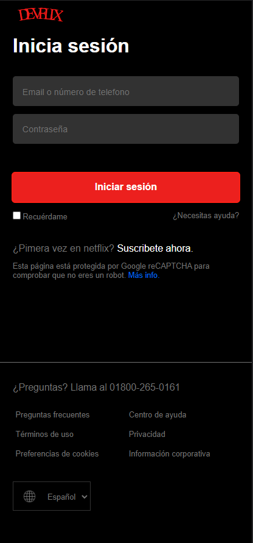

# **Clon del Inicio de sesión de netflix**  

 

 

## **Tecnologías**
 

## **Instalación:**
1. Clona este proyecto.
     `git clone https://github.com/Jenzyy/clone-netflix.git`
2. Ve a la carpeta del proyecto
     `cd clone-netflix`
## **Construir:**
 ### Compilar Sass:
        sass --watch ./scss:./css

